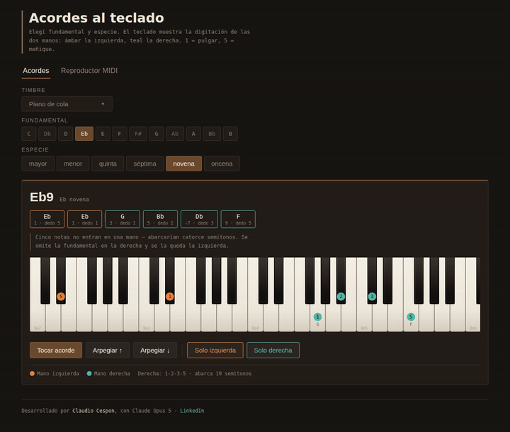
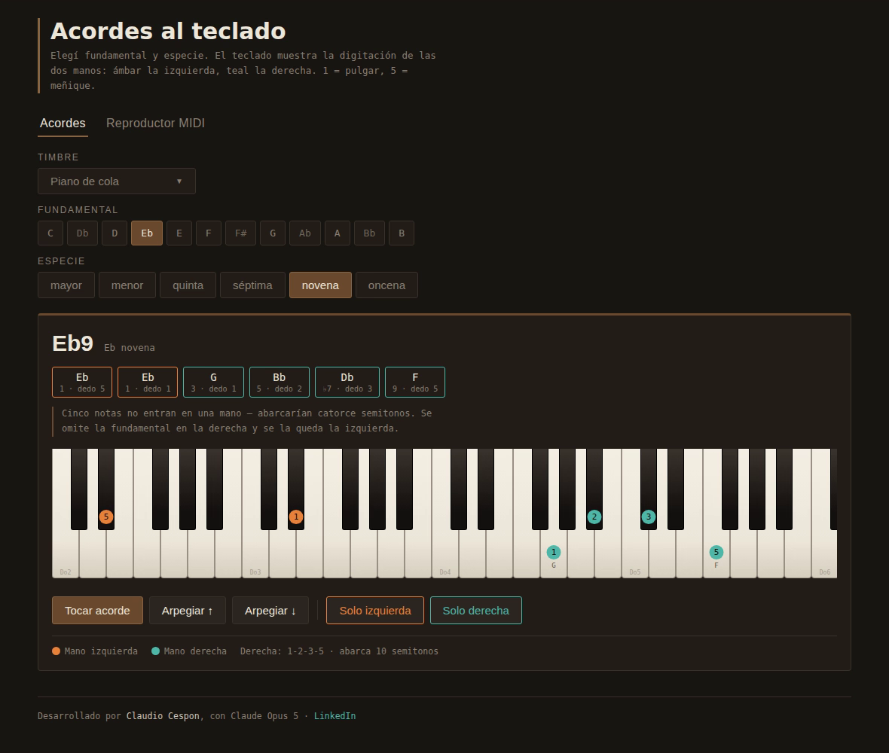
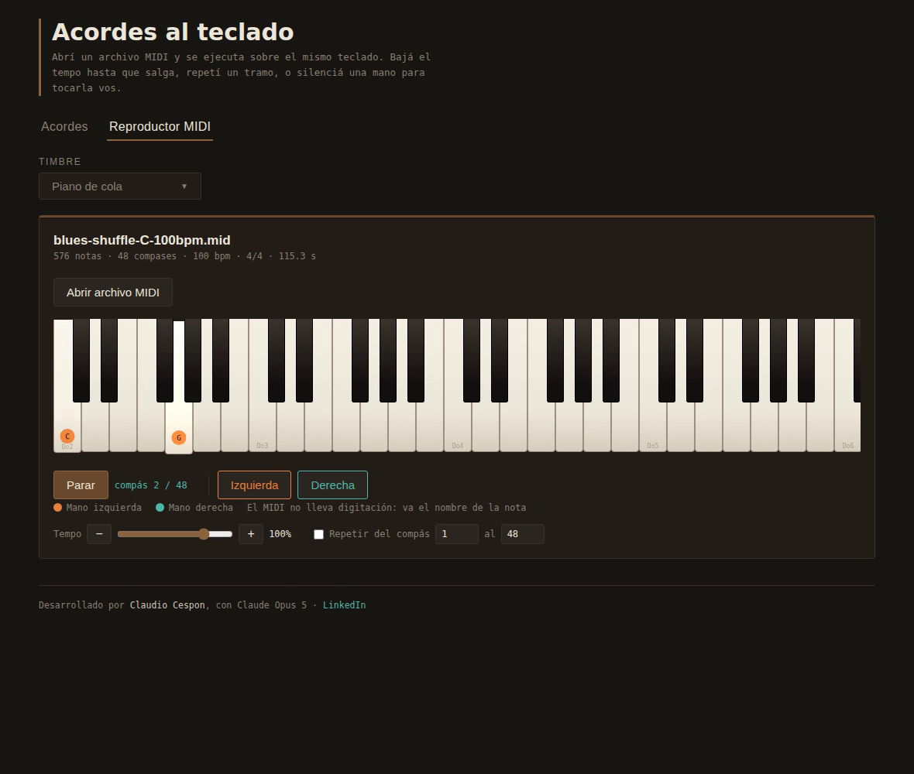

# 🎵 Herramientas de Estudio Musical (HTML Instruments)

Una suite interactiva, moderna y ultra-ligera de aplicaciones web para la práctica y el estudio musical, construida exclusivamente con **HTML5, Vanilla JavaScript y Web Audio API puro**.

Cada instrumento es un archivo HTML independiente: se abre directamente en cualquier navegador con doble clic, funciona 100% offline, no requiere Node.js, servidores ni instalación de librerías externas, y sintetiza todo el audio en tiempo real.



---

## 🚀 Enlaces Rápidos

* 🌐 **[Probar Suite Online en vivo (GitHub Pages)](https://cdcespon.github.io/html-instruments/)**
* 🌐 **[Preview alternativo (htmlpreview)](https://htmlpreview.github.io/?https://github.com/cdcespon/html-instruments/blob/main/index.html)**
* 📥 **[Descargar Proyecto Completo (.ZIP)](https://github.com/cdcespon/html-instruments/archive/refs/heads/main.zip)**
* 🎥 **[Ver Video de Demostración con Audio (`demo.mp4`)](demo.mp4)**

---

## 📱 Aplicaciones Incluidas

| Aplicación | Archivo | Descripción Principal |
| :--- | :--- | :--- |
| 🏠 **Portal Principal** | [`index.html`](index.html) | Hub de acceso rápido a todas las herramientas e instrumentos de la suite. |
| 🎹 **Teclado & MIDI** | [`keyboard-chords.html`](keyboard-chords.html) | Acordes a dos manos, ortografía armónica exacta, 5 motores de síntesis y reproductor MIDI por compases. |
| 🎸 **Guitarra** | [`guitar-chords.html`](guitar-chords.html) | Generador de digitaciones de acordes ordenadas por comodidad, detección de cejillas, escalas y pentatónicas. |
| 🎸 **Bajo** | [`bass-fretboard.html`](bass-fretboard.html) | Optimizador de digitaciones de líneas de bajo con mínima distancia de mano, escalas y mástil para 4, 5 y 6 cuerdas. |
| 🥁 **Batería** | [`drum-grooves.html`](drum-grooves.html) | Grooves interactivos y editables con práctica por capas y código de color por extremidad (bombo, tambor, hi-hat). |
| 🎷 **Armónica** | [`harmonica-map.html`](harmonica-map.html) | Mapa completo de agujeros Richter, notas sopladas, aspiradas y bends calculados, 6 posiciones y recomendador de tonalidad. |

---

## ✨ Características Destacadas

### 1. 🎹 Teclado & Reproductor MIDI ([`keyboard-chords.html`](keyboard-chords.html))
* **Ortografía armónica exacta**: Aritmética de letras musicales (sin reemplazos arbitrarios de sostenidos/bemoles; la 7ª de Do siempre se analiza sobre Si).
* **Distribución a dos manos (Voicings)**:
  * 🟠 **Mano izquierda (Ámbar)**: Fundamentales, quintas y bajos.
  * 🟢 **Mano derecha (Teal)**: Estructura, extensiones (3ª, 7ª, 9ª, 11ª) y tensiones.
* **5 Motores de síntesis en tiempo real (Web Audio API)**:
  * 🎹 **Piano de cola**: Síntesis aditiva con parciales inarmónicos, rigidez de cuerda, desafinación unísono y ruido de martillo.
  * ⚡ **DX7 E.Piano**: Síntesis FM basada en el clásico patch *E.PIANO 1* (algoritmo 5).
  * 🎼 **Rhodes**: Síntesis FM con ataque metálico de modulación rápida y cuerpo cálido.
  * 🎷 **Hammond**: Síntesis aditiva de 9 barras armónicas (*drawbars*) y *key click*.
  * 🎛️ **Moog**: Síntesis sustractiva analógica con osciladores dobles en diente de sierra y filtro pasabajos resonante.
* **Reproductor MIDI integrado**: Carga tus propios archivos `.mid`/`.midi`, visualiza notas en tiempo real separadas por mano, controla tempo (30%–120%), aísla manos y define loops por compases para estudio.

<p align="center">
  
</p>
<p align="center">
  
</p>

---

### 2. 🎸 Guitarra — Acordes y Escalas ([`guitar-chords.html`](guitar-chords.html))
* **Generador inteligente de digitaciones**: Recorre y evalúa combinaciones posibles según ergonomía de la mano (extensión de dedos, comodidad y cejillas).
* **Detección automática de cejilla**: Identifica cuándo un dedo índice cubre múltiples cuerdas.
* **Escalas y Pentatónicas**: Visualiza las 5 posiciones clásicas de la escala pentatónica a lo largo del mástil.
* **Múltiples afinaciones**: Estándar (EADGBE), Drop D, DADGAD y Abierta en Sol.

---

### 3. 🎸 Bajo — Mástil y Optimizador de Líneas ([`bass-fretboard.html`](bass-fretboard.html))
* **Optimizador de digitaciones de líneas**: Calcula la asignación óptima de cuerda y traste para minimizar los desplazamientos de la mano sobre el mástil.
* **Mapas de Escalas y Arpegios**: Tónicas, notas de escala y cuerdas al aire resaltadas.
* **Configuraciones de mástil**: Soporte para 4 cuerdas estándar, Drop D, 5 cuerdas (Si grave) y 6 cuerdas (Si grave + Do agudo).

---

### 4. 🥁 Batería — Grooves y Práctica por Capas ([`drum-grooves.html`](drum-grooves.html))
* **Práctica por capas**: Aísla o combina elementos para estudiar la coordinación (bombo solo, sumando tambor, sumando hi-hat).
* **Identificación por extremidad**: Código de color para mano derecha, mano izquierda y pie derecho, incluyendo notas fantasma.
* **Biblioteca de grooves**: Patrones clásicos de Rock, Funk, Shuffle, Bossa Nova, etc., configurables en subdivisiones de corcheas o tresillos.

---

### 5. 🎷 Armónica — Mapa de Agujeros y Bends ([`harmonica-map.html`](harmonica-map.html))
* **Mapa de notas Richter**: Visualización de notas sopladas y aspiradas para las 12 tonalidades de armónicas diatónicas.
* **Bends calculados dinámicamente**: Cálculo de notas dobladas según la física de lengüetas opuestas en cada agujero.
* **6 Posiciones explicadas**: Información teórica de posiciones para blues, jazz, rock y modal.
* **Buscador de tonalidad**: Indica al instante qué armónica y en qué posición tocar según el tono del tema.

---

## 📁 Biblioteca de Riffs MIDI Incluida

El repositorio incluye más de 40 archivos MIDI listos para cargar y practicar en la carpeta [`riffs-midi/`](riffs-midi/):

| Género / Estilo | Tonalidades disponibles | BPM Referencia |
| :--- | :--- | :--- |
| **Blues Lento** | A, Bb, C, Eb, F, G | 60 BPM |
| **Blues Shuffle** | A, Bb, C, Eb, F, G | 100 BPM |
| **Bossa Nova** | A, Bb, C, Eb, F, G | 132 BPM |
| **Chacarera** | A, Bb, C, Eb, F, G | 100 BPM |
| **Montuno** | A, Bb, C, Eb, F, G | 160 BPM |
| **Rock Octavas** | A, Bb, C, Eb, F, G | 132 BPM |
| **Rock Órgano** | A, Bb, C, Eb, F, G | 116 BPM |

> Incluye también el script [`generar.py`](riffs-midi/generar.py) para crear o modificar patrones MIDI algorítmicamente con Python (`python3 riffs-midi/generar.py --listar`).

---

## 💻 ¿Cómo ejecutarlo?

No requiere instalación, dependencias ni conexión a internet:

1. Clona o descarga este repositorio:
   ```bash
   git clone https://github.com/cdcespon/html-instruments.git
   ```
2. Abre [`index.html`](index.html) (o cualquiera de los archivos `.html` individuales) en tu navegador preferido (Chrome, Firefox, Safari, Edge).
3. ¡Listo! Todo funciona localmente y al instante.

---

## 👤 Autor

Desarrollado por **Claudio Cespon**
* 💼 [Perfil en LinkedIn](https://www.linkedin.com/in/claudio-cespon/)
* 🐙 [GitHub: @cdcespon](https://github.com/cdcespon)

---
*Licencia MIT · Desarrollado con HTML5, CSS3, JavaScript & Web Audio API.*
